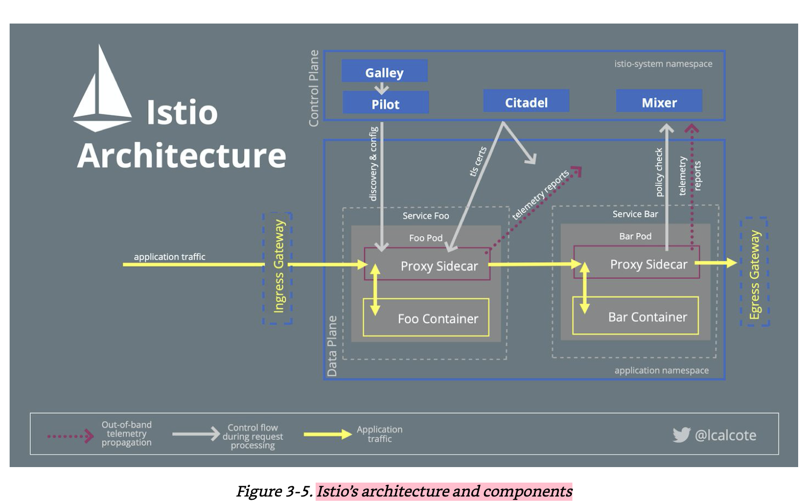

# Istio 

https://istio.io/latest/docs/concepts/what-is-istio/

*** 

## Service Architecture



istio의 service mesh 아키텍처는 크게 두 가지 부분으로 나뉜다. Control Plane 영역과 Data Plane 영역. 

Control Plane은 서비스 프록시들을 관리하는 단일 지점으로 역할을 하고 직접적인 mesh에 있는 패킷을 다루지 않지만 패킷 전달에 대한 policy 들을 다룬다. 

Data Plane은 클러스터 내 모든 요청 패킷을 intercept 해서 라우팅을 해준다던지 health checking, authentication / authorization, load balancing 과 같은 역할을 해준다.  

크게 하는 역할은 다음과 같다. 

Control Plane
- monitoring
- policy configuration
- service discovery
- identity management
- network topology

Data Plane
- packet forwarding
- load balancing
- routing
- caching
- policy enforcement

각 구성 요소를 살펴보면 다음과 같다.
 
#### Pilot 

파일럿은 Envoy가 서비스의 엔드포인트를 알 수 있도록 서비스 디스커버리 기능을 제공해준다.

그리고 파일럿은 Envoy의 통신 즉 서비스간의 트래픽의 경로를 통제해주는 역할을 해줄 수 있다.

이 외에도 Envoy가 하는 기능인 retry, timeout, circuit breaker 같은 설정 정보를 제공해주는 역할을 한다.

#### Mixer 

믹서가 하는 일은 요청에 대한 정책을 통제하거나 모니터링 지표의 수집을 한다.

서비스가 처리량 이상만큼 요청을 못받도록 설정하거나 특정 헤더값이 일치해야 요청을 받도록 하는 정책 기능을 제공해준다.

또한 서비스의 응답 시간이나 평균 처리량 같은 다양한 지표를 수집한다.

#### Citadel

시타델은 보안에 관련된 기능을 제공한다.

서비스간 인증이나 인가를 담당하고 서비스간 통신에 TLS을 이용해서 암호화 하도록 제공해준다.

#### Galley

Galley는 Kubernetes의 YAML 파일을 해석하여 Istio가 이해하는 형식으로 변환하는 일을 맡고 있습니다. 

Galley는 다른 구성 데이터를 Istio가 이해하는 공통 형식으로 변환하기 때문에 Kubernetes가 아닌 다른 환경과의 작업을 가능하게 합니다.

#### Sidecar Proxy 

Istio의 Envoy Proxy는 사이드카 형식으로 어플리케이션 컨테이너와 같이 쿠버네티스 pod에 자동으로 배포된다.  

Envoy Proxy는 기존 프록시의 기능인 L4 뿐 아니라 L7 기능도 지원하면서 HTTP 뿐 아니라 HTTP 2.0 TCP gRPC등 다양한 기능을 제공한다.

이런 Envoy Proxy는 다양한 기능은 다음과 같다.

- HTTP, TCP, gRPC 프로토콜 지원

- HTTP2 지원

- 서비스간 통신에 TLS client certification 지원

- Auto retry, circuit breaker, 부하량 제한 등 다양한 로드 밸런싱 기능 지원

- 모니터링 및 추적 기능 제공 및 마이크로서비스간 분산 트랜잭션 성능 측정 제공해서 서비스 간 가시성(Visibility)를 제공

- Dynamic Configuration 지원을 통해서 중앙 레파지토리에서 설정 정보를 읽어와서 서버의 재시작 없이 라우팅 기능을 제공해준다.

- L7 라우팅 지원


***

## Gateway 

Gateway는 외부로부터 트래픽을 받는 최앞단으로 여기서 지정할 값은 트래픽을 받을 호스트 명과

포트, 프로토콜을 정의한다. 

예제는 다음과 같다. 

```yaml
apiVersion: networking.istio.io/v1alpha3
kind: Gateway
metadata:
  name: bookinfo-gateway
spec:
  selector:
    istio: ingressgateway # use istio default controller
  servers:
    - port:
        number: 80
        name: http
        protocol: HTTP
      hosts:
        - "ext-host.example.com"
```
- 여기서는 ext-host.example.com 으로 들어오는 요청 중 HTTP 프로토콜을 쓴다면 이 게이트웨이가 요청을 받겠다 라는 의미다. 
 
***

## Virtual Service 

들어온 트래픽을 서비스로 라우팅 하는 기능이다. 목적지는 쿠버네티스의 service가 된다. 

실제로 Virtual Service의 기능은 URI 기반으로 라우팅을 하는 Ingress와 유사하다. 

예제는 다음과 같다.

```yaml
apiVersion: networking.istio.io/v1alpha3
kind: VirtualService
metadata:
  name: bookinfo
spec:
  hosts:
  - "*"
  gateways:
  - bookinfo-gateway
  http:
  - match:
    - uri:
        exact: /productpage
    - uri:
        prefix: /static
    - uri:
        exact: /login
    - uri:
        exact: /logout
    - uri:
        prefix: /api/v1/products
    
    route:
    - destination:
        host: productpage
        port:
          number: 9080
```
- hosts는 클라이언트에서 요청한 request에 대해서 어떤 host를 호출할 것인지 결정한다. (host는 service 라고 생각하면 된다.)
  여기서는 hosts: "*" 로 지정했기 떄문에 virtualservice가 라우팅 할 모든 요청에 대해서는 gateway: bookinfo-gateway 와 연관되어 있다.
  이 bookinfo-gateway로 들어온 요청에 대해 라우팅 처리로 서비스를 호출한다. 
- gateways는 어떤 게이트웨이에서 들어온 요청을 트래픽 처리할 것인지 지정해준다. 여기서는
  gateways: bookinfo-gateway로 지정했으므로 bookinfo-gateway에서 들어온 요청에 대해 라우팅
  처리를 해준다. 
- http는 URL 별로 라우팅을 하도록 정의했다. http: match: 부분을 보면 해당 url에 대해 정확히
  일치하는 가를 따질려면 exact를 쓰면 되고 해당 url과 일부만 맞으면 된다면 prefix를 쓰면 된다. 
- route: destination: host:는 http: match: 와 맞는 url로 요청이 오면 호출할 서비스를 지정한 것이다. 여기서는 productpage
  서비스를 호출한다. {namespace}.svc.cluster.local 서비스로 포워딩된다. namespace를 지정하지 않는다면 기본적으로는 default가 된다. 
  
virtualService의 다음 예제는 gateway와 연동되지 않고 service와 연동되서 service를 호출할 때 라우팅 처리를 정의한 것이다.

```yaml
apiVersion: networking.istio.io/v1alpha3
kind: VirtualService
metadata:
  name: reviews-route
spec:
  hosts:
  - reviews.prod.svc.cluster.local
  http:
  - name: "reviews-v2-routes"
    match:
    - uri:
        prefix: "/wpcatalog"
    - uri:
        prefix: "/consumercatalog"
    rewrite:
      uri: "/newcatalog"
    route:
    - destination:
        host: reviews.prod.svc.cluster.local
        subset: v2
  - name: "reviews-v1-route"
    route:
    - destination:
        host: reviews.prod.svc.cluster.local
        subset: v1
```
 - 이 예제는 reviews.prod.svc.cluster.local 서비스를 호출할 때 동작하는 virtualservice이다. 
 - 요청 uri이 /wpcatalog 나 /consumercatalog 로 시작한다면 uri를 /newcatalog로 바꾼다. 
 - 그 후 subset을 v2로 (service version을 말한다) 해서 reviews.prod.svc.cluster.local이 서비스에 v2 버전으로 전달한다.
   - subset 에 대해서 좀 더 설명하자면 apiVersion을 위해 subset을 사용할 수 있고 카나리 배포환경에서도 사용할 수 있다. 
 - 요청 uri이 /wpcatealog 나 /consumercatalog 로 시작하지 않다면 reviews.prod.svc.cluster.local 서비스에 v1 버전으로 전달한다. 

마지막으로 다른 예제를 보자. 

```yaml
apiVersion: networking.istio.io/v1alpha3
kind: VirtualService
metadata:
  name: my-productpage-rule
  namespace: istio-system
spec:
  hosts:
  - productpage.prod.svc.cluster.local # ignores rule namespace
  http:
  - timeout: 5s
    route:
    - destination:
        host: productpage.prod.svc.cluster.local
```
 - 이 예제는 별도의 라우팅 없이 productpage.prod.svc.cluster.local을 그대로 호출하도록 정의했다. 
 - 다만 특별한 점은 timeout: 5s 로 줘서 해당 서비스가 5초동안 응답이 없다며ㅑㄴ timeout 처리를 하도록 했다. 
 
VirtualService의 개념을 이해할때 헷갈릴 수 있는데 다음 두 가지를 기억하면 이해에 도움이 된다.

- 쿠버네티스의 Ingress와 같이 들어오는 트래픽에 대해 URI나 Request Header 정보를 바탕으로 라우팅을 할 수 있다. 
- Gateway나 service를 통해서 들어오는 트래픽에 대해서 service로 라우팅을 시킬 수 있다.  


Reference: [Istio Traffic management](https://bcho.tistory.com/1367)
***

## DestinationRule 

Virtual Service 가 쿠버네티스로 들어오는 트래픽을 어떤 서비스로 전달할 것인지 결정했다면

DestinationRule 은 서비스로 들어온 트래픽을 어떤 Pod 에게 어떻게 전달할 것인지를 결정할 것인지를 정하는 문제다. 

예제는 다음과 같다. 

```yaml
apiVersion: networking.istio.io/v1alpha3
kind: DestinationRule
metadata:
  name: my-destination-rule
spec:
  host: my-svc
  trafficPolicy:
    loadBalancer:
      simple: RANDOM
  subsets:
  - name: v1
    labels:
      version: v1
  - name: v2
    labels:
      version: v2
    trafficPolicy:
      loadBalancer:
        simple: ROUND_ROBIN
  - name: v3
    labels:
      version: v3
```  
- my-svc (my-svc.{namespace}.svc.cluster.local) 서비스로 들어오는 트래픽을 어떻게 pod로 전달할지를 정의했다.
- 이를 subset 을 통해 pod의 version 별로 그룹핑을 했다. 
- trafficPolicy: loaBalancer: 를 보면 로드밸런서 전략을 v1의 경우 RANDOM 으로 정했고 
  v2의 경우에는 ROUND_ROBIN으로 정했다. 이 외에도 LEAST_CONN 이라고 해서 두개의 랜덤 Pod 중 요청이 더 적은쪽을 선택하도록 할 수 있고
  PASSTHROUGH 옵션을 통해 로드밸런싱을 수행하지 않고 호출자가 요청한 원래 IP주소로 연결할 수 있다. 
  
***

## Traffic Management Best Practices


## JWTRule

Istio 에서 인증 정책으로 JWT 검증을 할 수 있다. 

여기서는 JWT과 검증에 대해서 알고있다고 가정하고 JWTRule에서 정의할 수 있는 속성들을 살펴보갰다.

예제는 다음과 같다. 

```yaml
apiVersion: authentication.istio.io/v1alpha1
kind: Policy
metadata:
  name: api-origin-auth
  namespace: gke-system
spec:
  targets:
    - name: istio-ingress
      ports:
        - number: 80
        - number: 443
  origins:
    - jwt:
        issuer: "https://securetoken.google.com/$GOOGLE_CLOUD_PROJECT"
        audiences:
          - "$GOOGLE_CLOUD_PROJECT"
        jwksUri: "https://www.googleapis.com/service_accounts/v1/jwk/securetoken@system.gserviceaccount.com"
        fromHeaders:
          - name: Authorization
            prefix: "Bearer"
        trigger_rules:
          - excluded_paths:
              - exact: /api/healthz
            included_paths:
              - prefix: /api/
``` 
- issuer:만 반드시 등록해야 하는 속성으로 JWT를 발급한 주체를 말한다.
- audiences:를 통해 등록된 사람들만 서비스 요청이 가능하게 할 수 있다.
- jwksUri:를 통해 검증을 할 publicKey 위치를 등록할 수 있다.
- jwtHeaders:를 통해 요청 헤더에 있는 토큰 위치를 기술할 수 있다. 
 


